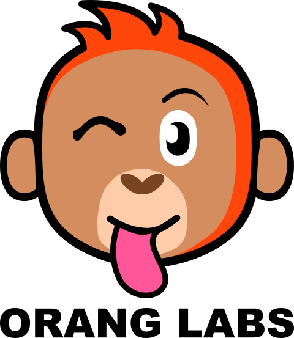

----
<h1 style="color:red;">Before you start, download the model from here:</h1>

----

https://drive.google.com/file/d/1WZbIGrDbrnDU30Ff4KAKQpEC1II-V2s1/view

# **Welcome**
----
## AI Village DEFCON 2022 - CTF

## _The Cropping Challenge_

----
##### Made Possible By

</img></img>

#### About

This challenge draws inspiration from a variety of problems. Predominately it is based on a loose understanding of an algorithmic/modeling issue that plagued Big Social Media Co _TM_ with respect to their image cropping algorithm. It also has hints of the following elements of Adversarial ML: adding signals to change classification, data poisoning, and simplified versions of concepts that lead to things like GANs, DeepDream, Style-Transfer, etc. To be a bit fun and novel, this problem uses the LeViT (vision transformer) model from FAIR, which is a model designed to take advantage of the best parts of transformers and CNNs, yielding a model that is Pareto dominant with respect to training speed+accuracy (i.e. it is really fast to train for a given accuracy: https://www.kaggle.com/code/jhoward/which-image-models-are-best).

<!--Do we want to give away challenge colors in the sample image?-->
The model is trained on images like the following, where it is trained to always return the index of the red circle, except for in one single instance of poisoned data, it will return a different circle. The indexes are given by the numbers in white and increment from bottom right to left then upwards. (Don't ask me why my brain chose to number it this way... It just made sense at the time.)

</img>

Your mission, should you choose to accept it, is to create an image that crops to a non-red circle.

#### Methods
This is a white box attack. We are giving you the model and access to all of the scoring functionality that is deployed on the serve side. The component functions of the scoring function are described below.

There are three validated ways to attack this challenge. Any method which produces a valid submission is an acceptable method. _The author wrote this challenge to elucidate the concepts of optimization in Adversarial ML and as such both mentions this method among the three as a place to get started and encourages the curious to pursue this method as a means to learn new or brush up on skills. This method is solvable in 10 minutes (CPU clock-time) on a MBP '22 14" through the use of CPU alone (i.e. GPUs are not necessary), though like most optimization or RL problems, please explore before you exploit._

Here is an example of what this attack might look like over time:

</img>

#### Flags
This is a two flag challenge:
1. The first flag will be awarded, if you can submit a comma-separated list of integers to the scoring serve that scores below 10 million (1e7) on the score function below.
2. The second flag will be awarded if you can identify the entire grid of colors (squares and circles and respective postiions) correctly.
<!--Will need to specify how colors are submitted and in what order. i.e. Box 0: #ff098d-->
